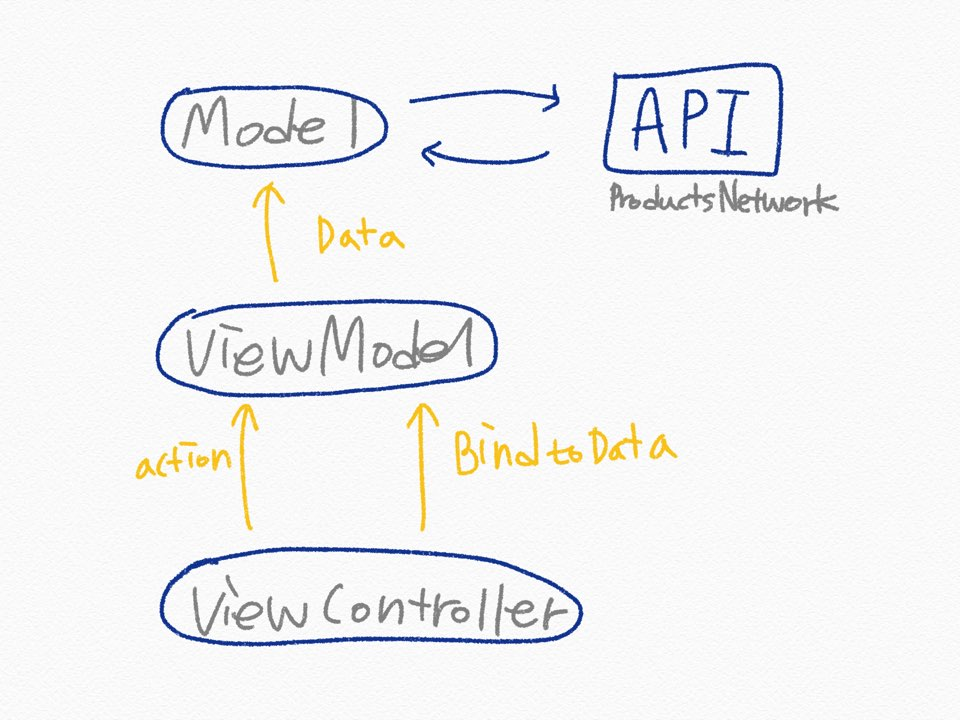

# Hwahae

[Market 프로젝트](https://github.com/HyopangWorld/Market)에서 + 추가 기능, 코드리뷰 받은 부분 발전한 프로젝트 입니다!
~~개인 캘린더에 일정을 잘못 등록해서 제출을 놓친건 안비밀...😭~~

1. 상품 목록 및 상세 화면


<br>

2. 피부 타입별 상품 목록 화면


<br>

3. 상품 검색 화면


<br>

###  Feature
1. 상품 목록 정보
2. 상품 목록 Pull-to-Refresh
3. 피부 타입별 목록 정보 (추가)
4. 상품 검색 (추가)
5. 상품 상세 정보
6. 버튼 Animation

<br>

### ✨ 리뷰 후 개선점✨
지난 idus 챌린지 때 받은 리뷰 후 개선점
<br>
1. 메모리 관리에 더욱 신경 쓰기 
     - self 순환 참조 제거 -> weak self 사용
     - deinit으로 메모리 해제 확인하기
2. 강제 언래핑 피하기
    - 강제 언래핑 제거
3. 코드 분리할때 연관 코드를 분리하지 않았는지 주의❗️
4. 의존성 제거❌
5. 데이터를 누적해서 문제가 됬던 distinct 메서드
    - scan으로 이전 데이터를 가져와 비교하는 방식으로 변경
6. 하드 코딩 제거 (상수제거)❌
7. 재사용성 높이기
    - view 컴포넌트 화 (indicator, header  분리 등등)
8. 지원 버전 낮춰 호환성 높이기
    - 기존 13.2 -> 12.0 변경

<br>

### 설계

이전 [Market 프로젝트](https://github.com/HyopangWorld/Market/blob/master/README.md#%EC%84%A4%EA%B3%84)의 구조와 같다.



<br>

### 구현

| **구분** |   **역할**   |
| :------------- | :--------------- |
| **Views** |
|       ViewController       |       UIViewController에 bind하기 위한 공통 ViewController        |
|       Indicator       |       공통  Custom Indicator        |
|       IndexViewController       |       viewModel에서 상품 목록 리스트를 받아 collection으로 뿌려준다.        |
|       IndexViewModel       |       view로 product list data를 binding 해준다.        |
|       IndexModel       |       상품 목록 리스트의 비즈니스 로직을 처리하는 부분.        |
|       DetailViewController       |      viewModel에서 상품 상세 정보를 받아 뿌려준다.        |
|       DetailViewModel       |       view로 product detail data를 binding 해준다.        |
|       DetailModel       |       상품 상세 정보의 비즈니스 로직을 처리하는 부분.         |
| **Components** |
|       ProductListCell       |       상품 목록 collection의 cell        |
|       ProductListHeader       |       상품 목록 collection의 header       |
| **Models** |
|       ProductResponse       |       API response 공통 모델        |
|       Product       |       API product 모델       |
| **Constans** |
|       Constants       |       App의 각종 상수        |
|       Enums       |       App의 각종 enum        |
| **Network** |
|       ProductsNetwork       |       API Network protocol        |
|       ProductsNetworkImpl       |      API Network protocol 구현, API 함수와 URL생성       |
| **Extension** |
|       UIApplication+Statusbar       |       status bar 색 지정 버전 대응을 위한 extesion       |
|       Reactive+UIViewController       |       비동기 형식으로 alert을 사용하기 위한 Rx extension        |
|       String+Utils       |       문자열에 Utils 성 메서드를 추가하기 위한 extension        |
|       UICollectionView+Utils       |       CollectionView에 Utils 성 메서드를 추가하기 위한 extension        |
|       UIViewController+Utils       |       ViewController에 Utils 성 메서드를 추가하기 위한 extension        |

<br>

### Git Management

- master : 개발 및 최종본

**Commit Message 양식은 아래의 규칙을 따른다.**  

```
[커밋 코드] 구현 및 수정 내용

| 공통 | 공통적으로 구현한 코드 |
| Index | Index 화면 관련 코드 |
| Detail | Detail 화면 관련 코드 |
```
<br>

### Style Guide

- Swift Dev Version : 5
- Deployment Target : 12.0
- Device Target : iPhone
- Code Architecture : MVVM
